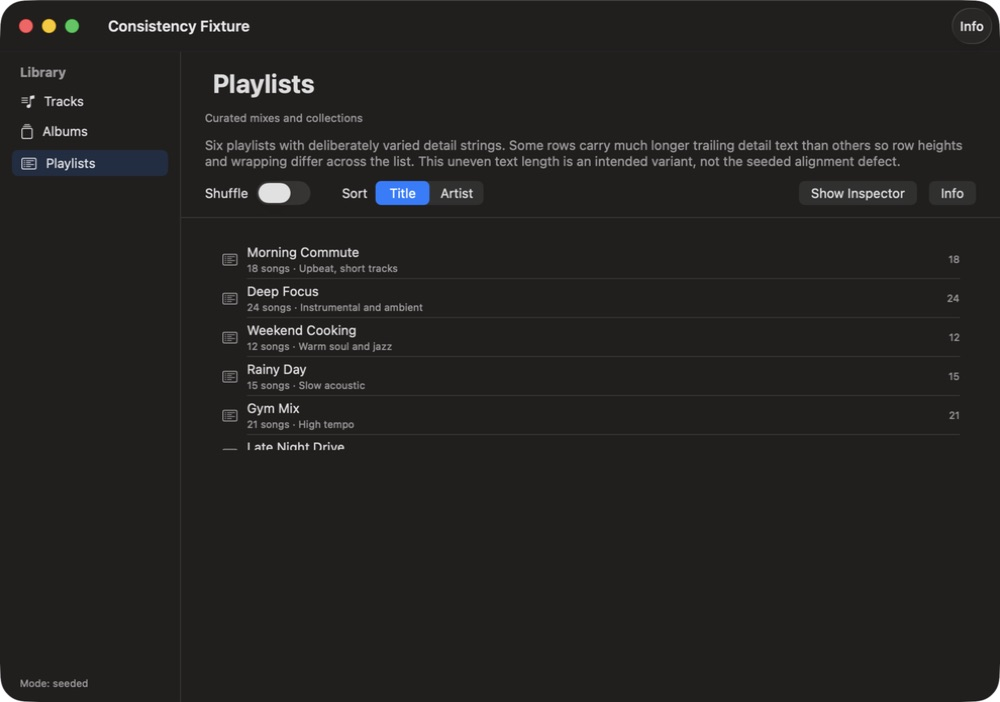
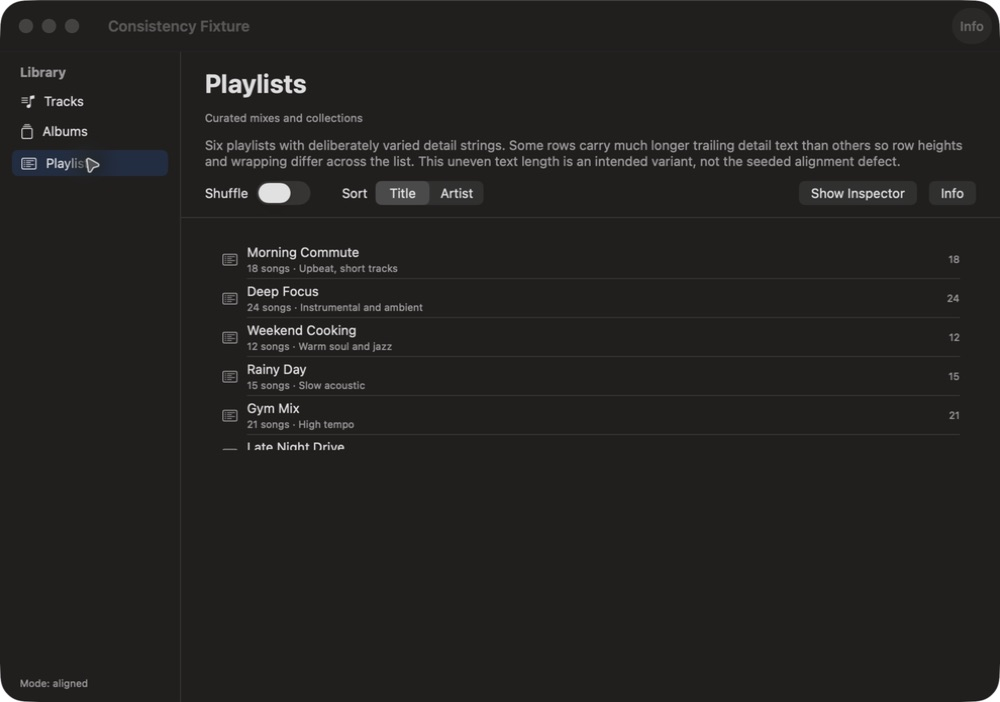
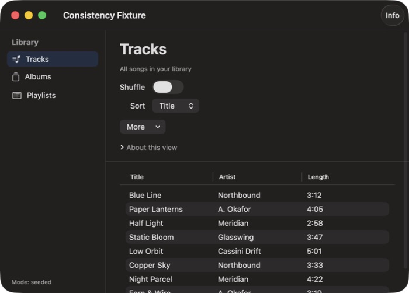
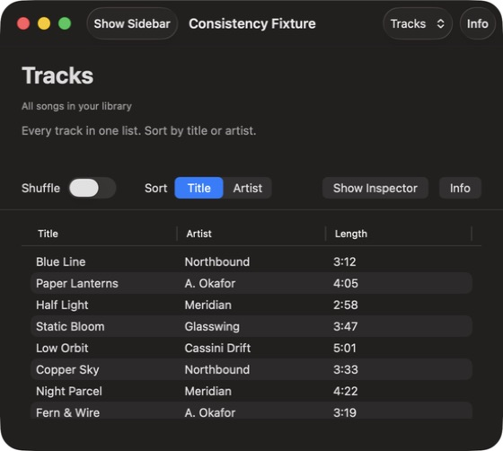

# macOS UI Consistency

[](https://github.com/Niko96-dotcom/macos-ui-consistency/actions/workflows/ci.yml) [MIT](LICENSE)

Guidance-driven skill plus a small deterministic CLI that audits macOS
SwiftUI / AppKit cross-screen consistency, reports with evidence, and
repairs only clear accidental app-owned drift. Deterministic tooling plus a native
SwiftPM fixture. No benchmarks claimed.

## Scope

In scope: whole-window relationships, shared shells and page families,
pane-local keylines, control appearance, state transitions, optical hierarchy, declared
numeric contracts compared against supplied measurements, eligible repairs
of accidental app-owned drift with before/after verification.

Out of scope: universal Swift rewriting, screenshot parsing or automated
keyline measurement, exhaustive scanning or coverage proof, built-in XCUI
adapter, repositioning native titlebar / toolbar / traffic lights / safe
areas, normalizing intentional variants. Examples are synthetic and
illustrative, not Apple requirements.

Example contract (app-decided, `fixture-regular`, pane-local pt; `24` is
the app choice, not a platform value):

| Surface | `contentTitle.leading` | Contract | Result |
| --- | --- | --- | --- |
| albums | 24.0 pt | 24.0 pt ± 0.5 | pass |
| tracks | 24.0 pt | 24.0 pt ± 0.5 | pass |
| playlists | 32.0 pt | 24.0 pt ± 0.5 | **fail** (delta 8.0) |

## Layout

- [Skill](skills/macos-ui-consistency/SKILL.md) — entrypoint, progressive disclosure.
- [Discovery](skills/macos-ui-consistency/references/discovery.md), [layout contracts](skills/macos-ui-consistency/references/layout-contracts.md), [verification](skills/macos-ui-consistency/references/verification.md), [window adaptation](skills/macos-ui-consistency/references/window-adaptation.md), [whole-window review](skills/macos-ui-consistency/references/whole-window-review.md), [data format](skills/macos-ui-consistency/references/data-format.md) (normative CLI JSON schema).
- [CLI](skills/macos-ui-consistency/scripts/ui_consistency.py) — stdlib-only `scan`, `compare`, `report`.
- [Contracts](examples/contracts.json), [measurements](examples/measurements.json), [expected comparison](examples/expected-comparison.json) — synthetic repo-root samples.
- [Tests](tests/test_ui_consistency.py) — `unittest` suite.
- [Validation scope](docs/VALIDATION.md) — exercised behavior and remaining limits.
- [Fixture](fixture/README.md) — seeded native demo app.
- [Scenarios](evals/scenarios.md) — checks and negative controls.
- [Transfer cases](evals/transfer-cases.md) — contrasting tasks plus adversarial majority-wrong case (not yet run).
- [Provenance](PROVENANCE.md), [contributing](CONTRIBUTING.md).

## Requirements

Python 3.10+ stdlib only for CLI and tests. Swift toolchain only for the
optional fixture on macOS. Any skill-compatible host that can load `SKILL.md`.

## Install

Clone, then copy the skill into one host directory you use. Never overwrites.

```sh
git clone https://github.com/Niko96-dotcom/macos-ui-consistency.git
SRC="macos-ui-consistency/skills/macos-ui-consistency"
DEST="$HOME/.codex/skills/macos-ui-consistency"
if [ -e "$DEST" ] || [ -L "$DEST" ]; then
  echo "exists, leaving untouched: $DEST"
else
  mkdir -p "$(dirname "$DEST")"
  cp -R "$SRC" "$DEST"
fi
```

For Claude Code, use `$HOME/.claude/skills/macos-ui-consistency` as the destination. Use the appropriate skill folder for other hosts. Or point the host at the
checked-out `skills/macos-ui-consistency/SKILL.md` with no install.

For an authorized update of an existing copy, compare it with the checkout
first and back it up outside the skill directory. Update the entrypoint,
references, scripts, and agent metadata together; copying only `SKILL.md`
can leave the host running an older schema. Preserve deliberate host-only
frontmatter such as Claude's `argument-hint`. Verify file hashes against the
source afterward (compare the entrypoint body separately if frontmatter
has an adapter field), and run a sample comparison through the installed
script. Do not remove unknown host-local files or copy `__pycache__`.

## Usage

Load `skills/macos-ui-consistency/SKILL.md` in the host. Default invocation
audits and applies only eligible repairs within the current authorization;
an explicit audit-only, review, or planning request forbids all app edits.

```text
$macos-ui-consistency audit native Mac UI across all known pages and fix eligible drift.
```

```text
$macos-ui-consistency audit-only review of native Mac UI across all known pages. Do not edit anything.
```

### CLI quickstart (repo root)

Family-only contracts remain version 1 compatible. Contracts version 2 adds
explicit `window` and `component` scopes selecting named surfaces across
families; absent targets are unverified. Measurements and outputs stay version 1.
Older CLIs reject version 2 contracts instead of ignoring the new scope. Details in the
[data format](skills/macos-ui-consistency/references/data-format.md).
Existing outputs are refused unless `--force`; symlinked outputs are refused.

```sh
mkdir -p .audit
python3 skills/macos-ui-consistency/scripts/ui_consistency.py scan fixture/Sources --output .audit/candidates.json
if python3 skills/macos-ui-consistency/scripts/ui_consistency.py compare examples/contracts.json examples/measurements.json --output .audit/comparison.json; then
  echo "pass"
else
  compare_status=$?
  if [ "$compare_status" -eq 1 ]; then echo "fail by design: see .audit/comparison.json"; else exit "$compare_status"; fi
fi
python3 skills/macos-ui-consistency/scripts/ui_consistency.py report .audit/comparison.json --output .audit/report.md
```

The sample `playlists` entry fails by design, so `compare` exits `1`:
`0` pass, `1` fail, `2` invalid input or I/O, `3` unverified without fail.
`scan` emits heuristic candidates only, never coverage proof. `compare`
checks supplied numbers only, not screenshots or taste.

Installed layout: resolve scripts relative to the loaded `SKILL.md`, e.g.
`SKILL_DIR` is the directory containing it, then
`python3 "$SKILL_DIR/scripts/ui_consistency.py" scan . --output .audit/candidates.json`.

### Fixture demo

See the [fixture](fixture/README.md) for the exact target. It seeds one
accidental keyline drift plus intentional variants that stay excluded.

```sh
swift build --package-path fixture
swift run --package-path fixture ConsistencyFixture --page playlists
swift run --package-path fixture ConsistencyFixture --page playlists --aligned
swift run --package-path fixture ConsistencyFixture --page playlists --compact
```

`--aligned` shows the reference layout mode. `--compact` starts at the
fixture-specific 560×450-point content minimum. Optional panes yield as the
window narrows, navigation remains available, and Inspector uses a sheet when
there is insufficient pane space. See the [window adaptation research](docs/WINDOW-ADAPTATION-RESEARCH.md)
and [fixture policy](fixture/README.md); these dimensions are not Apple-wide rules.

### Tests

```sh
python3 -m unittest discover -s tests -v
```

## Screenshots (reference captures, not repair proof)

| Seeded reference | Aligned reference |
| --- | --- |
|  |  |

Compact composition (native menu picker, secondary actions under More):



Tested minimum after an attempted drag below the supported size:



The seeded/aligned pair records the initial title-inset example; the compact
and minimum images show the subsequent window-policy revision.
Reference captures from the fixture on the verified host below. The sheet
dismisses with Return.

## Verification (current host only)

- 53 Python tests pass locally, including explicit shared scopes, missing
  targets, ownership/evidence gates, and byte-identical legacy output.
- Native fixture built with Swift 6.3.3 on macOS 26; seeded and aligned
  modes visually inspected, sheet Return dismissal checked. Compact navigation,
  inspector controls, and scrolling checked; long description truncation at
  minimum width remains a documented fixture limitation.
- GitHub CI runs `unittest` on Ubuntu Python 3.10 / 3.13 and compiles
  the fixture on macOS 14. The live badge above links to hosted results.
- First scored eval runs live on macOS (S1–S6 and S8 pass, S7 conditional
  pass with About-expand blocked; transfer cases 1–5 pass incl. a blinded
  adversarial run; true drags clamp; shortcuts/Escape/Return proven,
  Tab-order and VoiceOver-announcement open). Full evidence:
  [validation](docs/VALIDATION.md).

## Capabilities and roadmap

Shipped: heuristic Swift candidate scan, declared numeric contract compare,
Markdown report, six guidance checks, seeded fixture, eval scenarios.
Not shipped: screenshot parsing, universal auto-patcher, exhaustive
coverage proof, built-in XCUI adapter. Instrumented probe unimplemented.

## Links

- [Skill](skills/macos-ui-consistency/SKILL.md)
- [Data format](skills/macos-ui-consistency/references/data-format.md)
- [Window adaptation](skills/macos-ui-consistency/references/window-adaptation.md)
- [Fixture](fixture/README.md)
- [Scenarios](evals/scenarios.md)
- [Transfer cases](evals/transfer-cases.md)
- [Provenance](PROVENANCE.md)
- [Contributing](CONTRIBUTING.md)

## License

[MIT](LICENSE).
